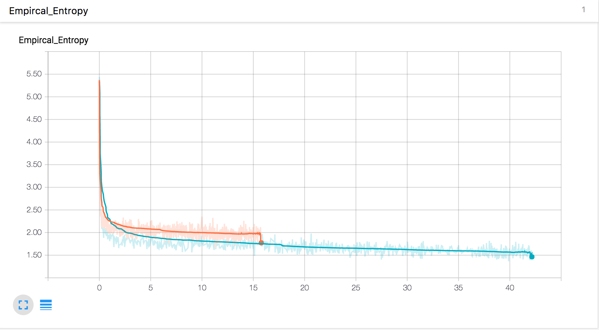
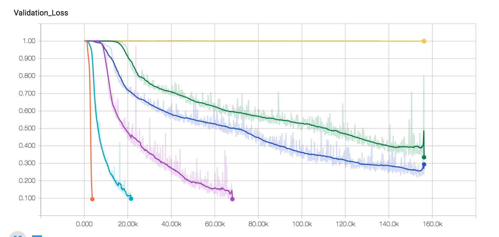
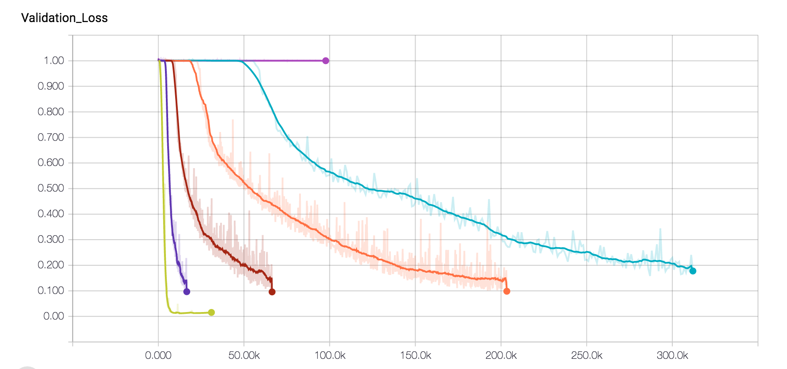

# Lossless compression using Neural Networks

## 1. Overview

### Motivation

Arithematic encoding has been used since past 20 years to achieve close to entropy compression for known distributions. Adaptive variants of Arithematic encoding \(for a chosen k-context model\) have also been designed, which first try to learn the conditional k-th order distribution, in the first pass nad use the same for compression in the second pass.

However, as the complexity increases exponentially in $k$, with the alphabet size. Generally the context is limited to $k = 5,10$. Higher values of context are not tractable. Can we consider RNN based models to achieve improved conditional probability, which in turn can be used along with arithmatic encoding.

Another important motivation this serves it with respect to how well can RNN's learn the probability distributions for compression, which can in turn help in intuitive understanding of RNN based image/video compression \(lossless or lossy\).

### Past work

There has been a lot of work on sequence prediction using RNN's, where the aim is to generate a sequence which resembles a given dataset. For eg: generating shakespeare's plays, etc.

1. Unreasonable Effectiveness of RNN: [http://karpathy.github.io/2015/05/21/rnn-effectiveness/](http://karpathy.github.io/2015/05/21/rnn-effectiveness/)
2. LSTM based text prediction: [http://www.cs.utoronto.ca/~ilya/pubs/2011/LANG-RNN.pdf](http://www.cs.utoronto.ca/~ilya/pubs/2011/LANG-RNN.pdf)
3. Prediction using RNNs \[Graves et.al.\]: [https://arxiv.org/abs/1308.0850](https://arxiv.org/abs/1308.0850)

There was also some work in early 2000's on lossless compression using neural networks. However, due to Vanilla RNN's not being able to capture long term dependencies well, the models might not have performed as well. Also in the past 5 years, the speeds of neural network have dramatically improved, which is a good thing for NN based probability estimators.

1. Neural Networks based compression: [http://ieeexplore.ieee.org/stamp/stamp.jsp?arnumber=478398](http://ieeexplore.ieee.org/stamp/stamp.jsp?arnumber=478398)
2. Matt Mahoney Implementation: [http://mattmahoney.net/dc/nn\_paper.html](http://mattmahoney.net/dc/nn_paper.html)

Also on the theoretical side, there are connections between predictors trained with log-loss and universal compression. Thus, if RNN's can act as good predictors, we should be able to utilize them into good compressors.n

1. EE376c Lecture Notes on Prediction: [http://web.stanford.edu/class/ee376c/lecturenotes/Chapter2\_CTW.pdf](http://web.stanford.edu/class/ee376c/lecturenotes/Chapter2_CTW.pdf)

Another interesting thing to note is that, RNN based models have been partially used in the state-of-the-art lossless compressors. They have been mainly used only for context mixing. The compressors find the probability of the next character based on multiple human-designed contexts/features \(eg: past 20 chars, 4 words, or alternate characters, only the higher bits of the last 10 bytes etc.\). These probabilites are "mixed" \(somethig like boosting using experts\), using a LSTM based context mixer.  
In fact, most of the leading text compressors, on the [Hutter prize](http://prize.hutter1.net/\) leaderboard use LSTMs for model mixing. For example, here is the flowchart for the [CMIX]\(http://www.byronknoll.com/cmix.html) use LSTM's for context mixing. 

Eg: CMIX compressor: [http://www.byronknoll.com/cmix.html](http://www.byronknoll.com/cmix.html)

### Applications

1. **Improved intuitive understanding** of RNN based structures for compression. The understanding can be used later to make improvements to more complex image/video compressors
2. **Wide Applications** to generic text/DNA/parameter compression. i.e. wherever arithematic encoding is used.
3. **Theoretical Connections** with log-loss based predictors, can be understood based on simple linear-RNN networks etc. 

### TODO

The plan is to test with sources such as:

1. iid sources
2. k-Markov sources
3. 0 entropy sources with very high markovity. For example
    X_n = X_{n-20} exor X_{n-40} exor X_{n-60}
4. Try compressing images: Eg: [https://arxiv.org/abs/1601.06759](https://arxiv.org/abs/1601.06759)

Wold be interesting to see, if the RNN network is able to figure out such deep correlations. Would be useful to also quantify the amount of state information required to achieve entropy limits with there sources \(what RNN models, how many layers\).

## Feb 17 Update

### IID sources and 3-4 Markov Sources

I tried with some small markov sources and iid sources. The network is easly able to learn the distribution \(within a few iterations\).

### 0 entropy sources.

For 0 entropy sources such as:   
    X_n = X_{n-20} exor X\_{n-k}

For sequence lengths of 10^7, 10^8 we are able to capture dependence very well for sources with $k &lt; 20,22$ with relatively small RNN networks \(1024, 3-layer networks\)  
However, above that markovity I am finding it difficult to train the network. Also, sometimes the network fails for smaller values of $k$ as well.   
I am still not sure what the reason is, currently trying some techniques of training.

### DNA Dataset

I tried with two real datasets, The first one is the chromosome 1 DNA dataset \(currently the model only supports 1D structures, so trying with sequences/text first\). For DNA compression, the LZ77 based compressors \(gzip etc. \) achieve 1.9 bits/base, while more state-of-the art custom compressors achieve 1.6 bits/base. Neural network based compressor achieved close to 1.6 bits/base compression. Which was encouraging.

### Hutter prize dataset

The Hutter prize is a competition for compressing the wikipedia knowledge dataset \(100MB\) into 16MB or less. Compressors like gzip are able to perform upto 34MB, while more carefully preprocessed LZTurbo, can perform upto 25MB. The best, state of the art compressors, \(which incidentally also use neural networks for context mixing\) perform close to 15MB. Our basic character-level model performs close to 20MB compression, which again is comparatively good.

The overall observation is that, the neural network is able to compress lower context very easily and pretty well. Capturing higher order contexts needs more careful training, or change in the model which I am still exploring.

## Feb 24 Update

We are able to train 0-entropy sources until a significantly high markovity in the first epoch itself. There are a few significant changes to the model to achieve this:

1. Retain the state from the previous batch. This is not the default behaviour in deep learning, as RNN's are generally applied on a single sentence during training. We explicitly store the state and reassign it. 
2. To get this working during training, we are as of now restricting BATCH\_SIZE=SEQ\_LENGTH\( SEQ\_LENGTH is the number of timeframes you backpropagate\)
3. We use simpler models \(32/64 sized 2-layer models, instead of 1024 3 layered models, as simpler models train quicker, and we dont need a bigger model for this application, which is also a good thing in itself, as it makes a lot of things better/faster\)
4. Lower learning rate helps for larger models for better convergence 
5. The baremetal code is here: [15\_char\_rnn\_gist.py](NN_compression/tf_char_rnn/15_char_rnn_gist.py)

### Improvements

We improve upon the previous results by training for Markovity 40 \(as against 20 in the previous case\). Experiments with higher markovity are ongoing.

Also, I kept the DNA compression and text compression code running, and both of them increased at a steady rate \(but slow\). The DAN dataset went from 1.5 bits/base  -&gt; 1.35 bits/base, and the Text dataset came to 16.5MB \(which is close to the 16MB competition limit, although excluding the decompressor\).

I believe, using simpler models, with the new changes can significantly boost the performance, which I am planning to do next.

### TODO

1. Check how well the models generalize
2. Run it on images/video? \(still needs some work\): see PixelRNN
3. Read more about the context mixing algorithms used in video codecs etc.

## Mar 3 Update

1. Running on a validation set of length 10000 \(every batch of training is a small sequence of 64 length\). It is observed that the model generalizes very well in most of the cases \(I observed 1 case, where the model was able to overfit the data significantly and not able to generalize to unseen sequences well. I am still investigating that scenario\)

2. I am able to train well for sequences until markovity 50 \(for a training sequence of length 64\). Above that, the model does not learn well. Comparison with xz. XZ is one of the best universal compressors.  '

   * All results for 2 epoch runs \(1 epoch training & 1 epoch compression\)
   * File size is 10^8
   * Model is a 32 cell 3 & 2 layer
   * The sequence length of training was 64 \(lengths higher than 64 will get difficult to train\)

#### 2-layer network

#### 3-layer network

| Markovity | 3-layer NN | 2-layer NN | XZ |
| --- | --- | --- | --- |
| 10 | 0.0001 | 0.0001 | 0.004 |
| 20 | 0.0002 | 0.0005 | 0.05 |
| 30 | 0.01 | 0.07 | 0.4 |
| 40 | 0.1 | 0.27 | 0.58 |
| 50 | 0.3 | 0.4 | 0.65 |
| 60 | 1 | 1 | 0.63 |

The results showcase that, even over pretty large files ~100MB, the models perform very well for markovity until 40-50. However, for longer markovity, it is not able to figure out much, while LZ figures out some things, mainly becasue of the structure of the LZ algorithm. \(I will regenerate data for markovity 60 a few more times to confirm, as 0.63 looks a bit low than expectations\).

This suggests that, we should be able to use LZ based features along with the NN to improve compression somehow. This also suggests that, directly dealing with images in a vanilla rasterized fashion would not work for Neural networks, and we need to pass the context in a more clever way.

### Analysis of how sequence length impacts the learning

It was observed that sequence length dramatically impacts the learning. One positive is that, the network does learn dependencies longer than sequence length sometimes. Although very long sequence lengths will suffer from vanishing gradients issue, which we need to think how to solve.

For a 16-size 2 layer network, with sequence length of 8, we were able to train for markovity 10 very well. however, anything above that  
\(markovity 15, 20, ...\) gets very difficult to train.

![val-1]\(images/val_loss_8.png)

